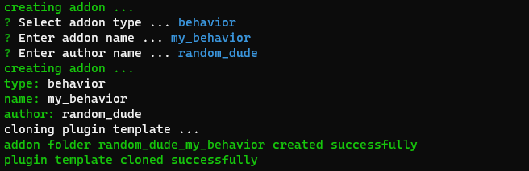

### FOR SDK V2 SUPPORT, USE THE NEW ADDON FRAMEWORK
https://github.com/ConstructFund/construct-addon-wizard-scaffold

# c3IDE2 Command Line Interface

## Usage

The CLI has an interactive mode, running the command will guide you through the creation of one of the addon-templates [plugin / behaviors / effects /theme ]

``` bash
c3ide2-cli-win.exe
```



---

you can also run the command with all the argument, to bypass the interactive mode

``` bash
c3ide2-cli-win.exe --type plugin --name my_plugin --author random_dude
```


### Server

The c3ide-cli comes built in with a web server that can be used to serve multiple development addons at a time. 


``` bash
c3ide2-cli-win.exe server
```

This command will start a server in the current directory and search for all addon.json files. you can optionally pass a path argument to the server command to serve files from a specificed directory. 

The server will assume that all addons exist in the current working directory (path) and follow the convention cwd/${addonFolder}/export/addon.json
